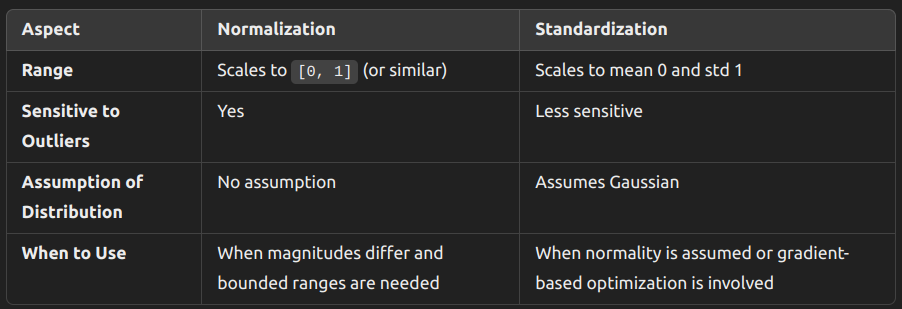

**Link :** [Understanding Feature Scaling](https://medium.com/@punya8147_26846/understanding-feature-scaling-in-machine-learning-fe2ea8933b66)

### Introduction to Feature Scaling

Feature scaling is a fundamental preprocessing step in machine learning aimed at ensuring that numerical features have a similar scale. This is pivotal because many machine learning algorithms perform better or converge faster when the input numerical features are on a similar scale.

### Why Feature Scaling

- Features - Height, Weight (Independent features) and BMI (Dependent feature)

- Features (Height and Weight) represents based on the magnitudes (values) or units(cm,m,kgs etc...)

- Algorithms should need scaling - Linear Regression, K means, KNN (clustering)

- Algorithms Should not apply scaling - Decision Tree, Random forest, Xgboost

Imagine a dataset where one feature measures annual income in tens of thousands of dollars, and another measures age in years. The disparity in their scales — thousands versus tens — can lead to issues. For instance, algorithms might give undue weight to features with larger numerical ranges, skewing results. Feature scaling addresses this by transforming data into a standard scale, enabling fair comparison between different features.

### Types of Feature Scaling

**1.Normalization:** This method scales each feature so that all values are within the range of 0 and 1. It achieves this by subtracting the minimum value of the feature and dividing by the range (difference between maximum and minimum values).

Normalization is achieved through a simple formula:

`(x — min(X)) / (max(X) — min(X))`

- x is the value you want to normalize
- min(X) is the minimum value in your data set
- max(X) is the maximum value in your data set

**When to Use:**

- Bounded Data: Use normalization when features have known and bounded ranges (e.g., image pixel intensities [0, 255]).
- Distance-Based Algorithms: Useful for models sensitive to the magnitude of features, such as:
- k-Nearest Neighbors (k-NN)
- k-Means Clustering
- Support Vector Machines (SVMs) with RBF kernels
- Sparse Features: Normalization can help when dealing with sparse data or features with very different ranges.
- When Feature Distribution is Unknown: If you don't know or assume the distribution of the features, normalization is safer as it doesn't depend on the distribution.

**2. Standardization:** Here, each feature is transformed to have a mean of 0 and a standard deviation of 1. This is achieved by subtracting the mean value and dividing by the standard deviation of the feature.

The formula for standardization is:

`Z = (x — μ) / σ`

Where:

- Z is the standardized score (also called a z-score)
- x is the original value you want to standardize
- μ (mu) is the mean of the data set
- σ (sigma) is the standard deviation of the data set

**When to Use:**

- Normally Distributed Data: Standardization works well for features that are approximately Gaussian (bell-shaped).
- Gradient-Based Algorithms: Models where optimization depends on gradient descent often benefit from standardization, such as:
- Linear Regression
- Logistic Regression
- Neural Networks
- PCA and SVD: Principal Component Analysis (PCA) and Singular Value Decomposition (SVD) assume standardization because they rely on variance.
  Features with Different Scales: Use when features have very different means and variances.

### Key Differences and Choosing the Right Technique

